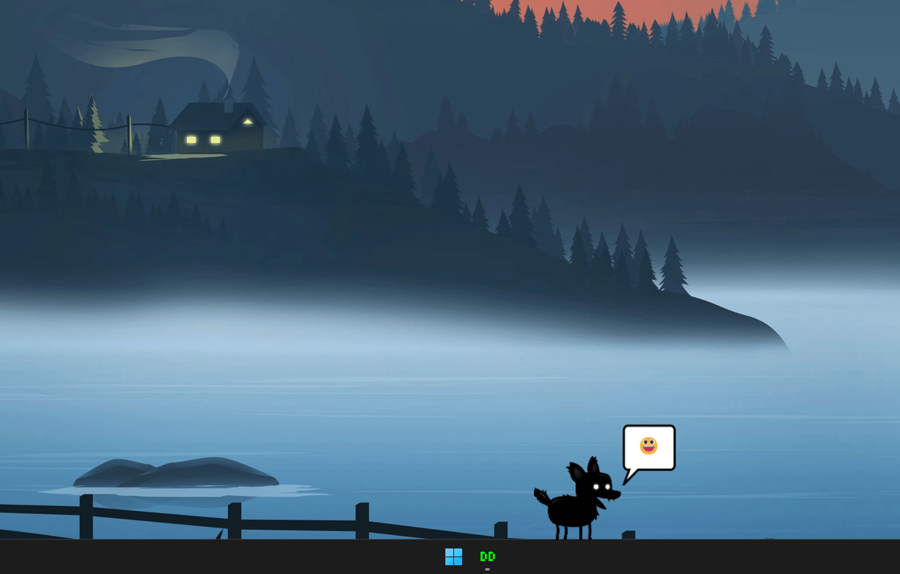

<!-- Header -->

   
  
  <!-- Logo -->
  

  <!-- Title -->
  ### Desktop Daemon
  
  <!-- Description -->
  Virtual Desktop Pets

  <!-- Repo badges -->
  
  
  

## Table of Contents
- [Template](#top)
  - [About](#about)
    - [Built With](#built-with)
  - [Setup](#setup)
    - [Development](#development)
  - [License](#license)

## About

Desktop Daemon is an experimental game I used to learn sprites. You can create customziable pets which live on your desktop. They can largly be ignored as they play along your taskbar but need attention from time to time.

DD was writen completely froms scratch using TypeScript and Electron.

### Built With

## Setup

  <h3 id="development" style="display: inline">
    Development
  </h3>

#### Prerequisites
- [Node.js](https://nodejs.org/en/download)

#### Instructions
1. Install the dependencies: `npm install`
2. Start the Angular server: `npm run start`

## License
Copyright © 2023 Zakary Timson | All Rights Reserved

See the [license](./LICENSE) for more information.
